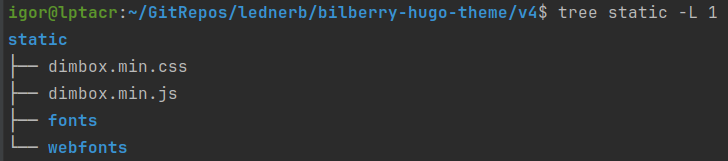

If you need to add an image lightbox to your Hugo theme and have no idea how to approach it, read this article, where I
present a simple and effective technique for achieving this. It is a continuation of the
series ["Hugo Theme Recipes"](/series/hugo-theme-recipes/).

<!--more-->



### Getting Started
What is an image lightbox? An image lightbox, also sometimes called an image modal zoom, is a window overlay that goes
over the website's currently displayed webpage to show a larger version of the image when the reader clicks on it.
This "magnification" lets the reader view high-resolution images in great detail. Such a feature would be a great
addition to a Hugo theme and, consequently, to a website based on such a Hugo theme.

So, where to start? It all comes down to two options. If you're well versed in CSS and JavaScript, you can roll up your
sleeves and implement an image lightbox yourself. The second option would be integrating an existing third-party image
lightbox plugin into your Hugo theme. In my case, while working on
the [Bilberry Hugo theme](https://github.com/Lednerb/bilberry-hugo-theme), I opted for a third-party
plugin since I'm not that good at CSS and JavaScript and didn't have enough spare time to implement it myself, so the
recipe shown below is based on a third-party plugin.

### Pick & Test Plugin

First, picking a suitable plugin from the plethora of available ones might be challenging and time-consuming. Based on
my experience, you can use the following selection criteria:
* It should be a relatively recent development with a public repository on GitHub, Bitbucket, etc.
* Its license should **not** be more restrictive than your Hugo theme license.
* It may also contain other functionalities, such as an image gallery, that you want to add to your Hugo theme.

Second, after narrowing down your choices, you must test selected plugins to see if they work well within your Hugo
theme. It is possible that a plugin's CSS may conflict with your theme's CSS, and that may cause problems with your
chosen plugin functioning correctly.

The technicalities of such testing will depend on the selected plugin and Hugo theme. Most lightbox plugin distributions
come in the form of CSS and JavaScript assets that you should manually add to your theme's `static` folder. For example,
the `static` folder in the Bilberry Hugo theme will look like below after downloading and copying minified assets for
the [DimBox](https://github.com/hphaavikko/dimbox) plugin:



In your Hugo theme, you locate a partial template file containing the `<head>` and `<body>` tags. For instance, in the
Bilberry Hugo theme, such a partial template is
the [`layouts/_default/baseof.html`](https://github.com/Lednerb/bilberry-hugo-theme/blob/e35ecca9f03c9579a9fca7aba0b5aa01563f197c/v4/layouts/_default/baseof.html)
file. Next, include the plugin's CSS and JavaScript assets in the `<head>` and `<body>` tags, respectively:

```html
<head>
    ...
    <link rel="stylesheet" href="dimbox.min.css" />
    ...
</head>
...
<body>
    ...
    <script src="dimbox.min.js"></script>
    ...
</body>
```

After all this, it's time to create a test article that contains an image. Place the raw HTML needed to
add an image within the article's markdown according to the plugin documentation. For most plugins, it is a variation of
the `<a>` tag with custom attributes, e.g., for the Dimbox plugin, that would be the following, given you copied
the `my-test-image.jpg` image to the `static` folder of your website:

```html
<a href="my-test-image.jpg" data-dimbox="my-test-image">
    
</a>
```

But since raw HTML is used to display the test image, Goldmark's `unsafe` property in the `config.toml` file of your
website should be set to `true` to render the above HTML block:

```toml
[markup.goldmark]
  [markup.goldmark.renderer]
    unsafe = true
```

Having confirmed with tests that the selected plugin works as expected, it's time to start integrating it into the
theme.

### Integration with Theme

Integrating a plugin with a theme consists of two parts: the plugin's assets integration and custom image render hook
implementation. The first part depends on how asset management and processing are implemented in your Hugo theme.
Suppose the theme does not use any tools for dependency management (e.g., npm) along with an asset processing pipeline (
e.g., Hugo pipes). In that case, it will suffice to save the plugin's resource files in the `static` folder of the theme
and include them in the theme's corresponding partial template within the `<head>` and `<body>` tags, as we did earlier
while testing plugins.

If your theme does use dependency management and/or asset processing tools, the plugin's assets will likely need to be
stored in the theme's `assets` folder, and certain changes will need to be made to the dependency management and asset
processing pipelines.

As for the second part, the default image render hook provided by Hugo,
namely `layouts/_default/_markup/render-image.html`, needs to be replaced by a custom one that will take into account
the implementation details of the selected lightbox plugin. That's because the default hook will render the markdown for
adding an image as the `` tag wrapped in the `<p>` tag. More on render hooks can be read
in [Hugo documentation](https://gohugo.io/templates/render-hooks/).

```markdown

```

For example, the above markdown will be rendered as follows:

```html
<p>
    
</p>
```

As an illustration, a custom image render hook template for the DimBox plugin can be implemented as below:

```html
<a href="{{ .Destination | safeURL }}" data-dimbox data-dimbox-caption="{{ .Text }}">
    
</a>
```

The above implementation will produce the following HTML for the image markdown:

```html
<a href="full/path/to/my-test-image.jpg" data-dimbox="" data-dimbox-caption="My Test Image">
    
</a>
```

You can also enhance your image render hook for displaying figures, that is, images with a caption or legend at the
bottom. The markdown for adding an image may contain an optional part, named `Title`, immediately after the path to the
image:

```markdown

```

You can add a condition to check if the image markdown contains the `Title` part. If so, the `<a>` tag along with
the `<figcation>` tag should be wrapped into the `<figure>` tag:

```html
{{ if .Title }}
<figure>
    <a href="{{ .Destination | safeURL }}" data-dimbox data-dimbox-caption="{{ .Text }}">
        
    </a>
    <figcaption>{{ .Title }}</figcaption>
</figure>
{{ else }}
<a href="{{ .Destination | safeURL }}" data-dimbox data-dimbox-caption="{{ .Text }}">
    
</a>
{{ end }}
```

That will generate the following HTML for the image markdown containing `Title`:

```html
<figure>
    <a href="full/path/to/my-test-image.jpg" data-dimbox="" data-dimbox-caption="My Test Image">
        
    </a>
    <figcaption>Fig. 1 - My Test Image Caption</figcaption>
</figure>
```

The recipe presented above is based on my hands-on experience working on the new major release of the Bilberry Hugo
theme. This theme already supported the modal image zoom via the Magnific Popup plugin. After migrating CSS and
JavaScript assets processing from npm and Laravel Mix to Hugo Pipes, this plugin stopped working, and I could not
pinpoint the root cause of that. Therefore, I had no choice but to replace the Magnific Popup plugin
with a new one, DimBox. For more information, see
this [commit](https://github.com/Lednerb/bilberry-hugo-theme/commit/01ecf2b1aff791df22411eb7fd262a3dce4359d2).

Continue reading the series ["Hugo Theme Recipes"](/series/hugo-theme-recipes/):

