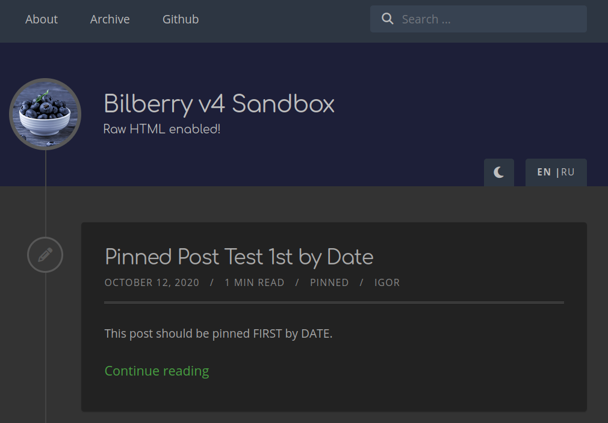

How quickly time flies. It seems that we recently summed up the results of 2022 for the Bilberry
Hugo theme, but 2024 has already arrived, and again, it is time to take stock of what has been
achieved over the past year.

<!--more-->

Back then, I concluded the summary for 2022 with the following:
> "I hope the New Year 2023 will be as fruitful as the past 2022, and the Bilberry Hugo theme will
> continue developing and delighting its users."

My hopes were justified; 2023 turned out to be a very productive year for the Bilberry Hugo theme,
which, during this period, continued its development with new **17** releases. One of the main
achievements of 2023 was the release of a new major version, namely `v4`, which contained several
breaking changes and other significant improvements.

Here is what the `v4` version contained:
- Migrate from npm to Hugo pipes for SCSS and JavaScript processing
- Migrate to the Hugo way of adding menu items in the top navigation bar
- Migrate from `highlight.js` to Hugo's built-in syntax highlighting
- Upgrade Font Awesome icons from `v5` to `v6`
- Migrate from the Magnific Popup plugin to DimBox for image modal zoom
- Add scroll back to the top button

Please read this [article](/article/bilberry-v4-released) to get more insights on the `v4`
development.

Another highlight of 2023 is the addition of support for day/night or light/dark theme mode. This
feature request was dated back to 2019, and finally, in 2023, it was implemented. Special thanks go
to our contributor, [Atsuya Watanabe](https://github.com/atsuyaw), who diligently worked on this
feature. The [Bilberry Sandbox](https://www.bilberry-sandbox.kiroule.com/) is deployed with this new
feature enabled, and you can try it out for yourself.

Here is a recap of other things that have been added, improved, and fixed in 2023, thanks to the
collaborative effort of numerous volunteers.

**New Features**

- Hyperlink image shortcode
- "prefix" for OGP in the head tag
- Generic hook system for further customizations and integration with third-party services

**Improvements**

- Only listen to `ESC` or `S` keys when required
- Adjusted behavior of language selector in site's header and footer
- Display copyright years as a range

**Bug Fixes**

- Broken RSS link in HTML
- `Continue Reading` link not displayed after summary split
- Broken categories' links in the footer when deployed on GitHub pages
- Archive page displayed in latest post section in the footer

The Bilberry Hugo theme has now:

- 339+ [stars](https://github.com/Lednerb/bilberry-hugo-theme/stargazers)
- 151+ [forks](https://github.com/Lednerb/bilberry-hugo-theme/network/members)
- 49+ [contributors](https://github.com/Lednerb/bilberry-hugo-theme/graphs/contributors)
- 21+ [translations](https://github.com/Lednerb/bilberry-hugo-theme/tree/master/i18n)

I look forward to 2024, continuing to put forth my best efforts and work hard to develop the theme
and support its users.
