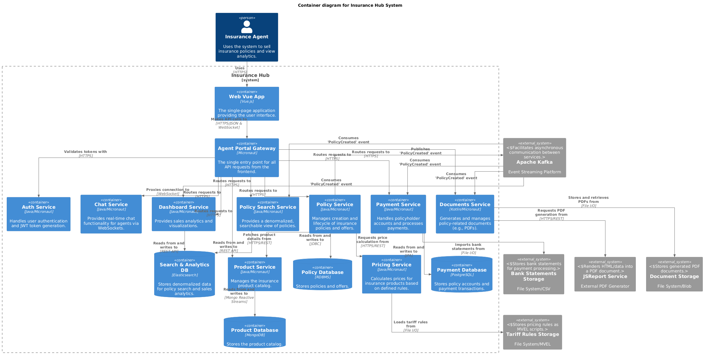
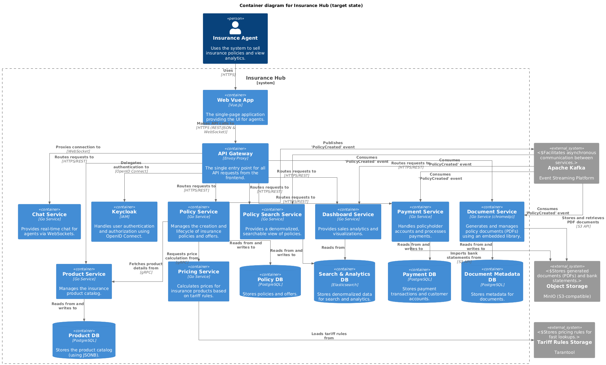

After years of mastering Go through books, exercises, and successfully migrating
my [Campsite Booking API](https://github.com/igor-baiborodine/campsite-booking-go) from Java, I'm
embarking on my most ambitious project yet: transforming a Java-based insurance system into a
modern, cloud-native Go application. This marks the beginning of a comprehensive migration journey
that will explore every aspect of system modernization—from architecture redesign to deployment
strategies.

<!--more-->

Unlike my previous Go learning projects, which started from scratch, this undertaking addresses the
real-world complexities of migrating an existing Java microservices system. In this inaugural post,
I will share my personal motivation for this transition, conduct a thorough analysis of the original
Java-based architecture, and present the target cloud-native design we will work towards. Join me as
I navigate the challenges and discoveries of this ambitious project.



### Raison d'Être or What's My Motivation

As a professional Java developer, I believe that real growth comes from stepping outside the
familiar. Learning another JVM-based language like Kotlin or Scala—even though they have their
strengths—doesn’t shift my mindset or challenge my habits the way picking up a language like Go
does. Go introduces me to entirely new programming paradigms and problem-solving approaches, thanks
to its minimalistic syntax, explicitness, and distinct concurrency model. Its straightforward
standard library and philosophy of “no hidden magic” push me to re-examine how I structure code and
systems. More importantly, Go is engineered for cloud-native development and microservices—domains
where modern software is heading—so adding it to my toolkit directly expands not just my technical
abilities but also my readiness for next-generation software challenges.

Making this leap is about more than simply adding a language to my resume. Immersing myself in Go
means grappling with new idioms, evolving my understanding of system design, and adapting to the
fast-paced, polyglot realities of today’s software teams. It positions me to contribute more
effectively in modern cloud environments and to approach both legacy migrations and greenfield
projects with renewed perspective and confidence. By embracing Go, I’m not just diversifying my
skill set—I’m deliberately preparing for where the industry is going, while also expanding the ways
I can create robust, scalable software solutions.

### Why Insurance Hub?

Before setting out to learn Go, I took a brief detour into Python. My efforts there never really
moved beyond getting comfortable with the syntax and solving a few HackerRank
challenges—engaging, but not transformative. With Go, I made a conscious decision to approach
things differently. I wasn't looking to just dabble in the language; I wanted to truly master the
broader Go ecosystem, the tooling, the patterns, and what it takes to build distributed,
cloud-native systems from scratch. The goal was simple: if I ever transitioned into a Go developer
role, I'd be productive and ready from day one.

I knew that mastering a new language—especially in parallel with a full-time job as a Java
developer—would be a gradual process, one that demanded patience and steady commitment during my
spare hours. My Go journey began in 2022 with Jon Bodner's "Learning Go," coupled with hands-on
practice through Exercism's Go track. In 2023, I raised the bar by working through Travis
Jeffery's "Distributed Services with Go Workshop." That book was a deep dive not just into Go, but
into distributed systems development, and many concepts were entirely new to me. I made it a point
to work through each chapter's code in my local environment, making sure everything ran as intended
and maintaining a fork of the repository to track my understanding alongside Go's evolving
ecosystem. I also challenged myself with problems from "Elements of Programming Interviews" to round
out my skills.

In 2024, I focused on "Event-Driven Architecture In Golang" by Michael Stack—one of the best
resources I've found on building event-driven, cloud-native systems in Go. Once again, I
methodically worked through the material, updating and experimenting with the source code to
reinforce new paradigms and idioms. Once again, I maintained a forked repository for the source code
to keep it current.

That same year marked a significant milestone: I set out to migrate my "Campsite Booking API" pet
project from Java to Go. Previously, I had documented the original Java implementation thoroughly on
my blog, sharing design decisions and lessons learned. Approaching the migration, I drew inspiration
from the Mallbots example in Michael Stack's book, applying its techniques, architectural structure,
and best practices as I rebuilt the application in Go. The process was demanding—spanning many
months—but the result was a fully functional Go-based microservice and a rewarding step forward
in my journey, now available as the campsite-booking-go repository.

To support my progress and explore new facets of Go, I dove into additional books: "Test-driven
Development in Go" by Adelina Simion, "Efficient Go" by Bartłomiej Płotka, "Functional Programming
in Go" by Dylan Meeus, and "Ultimate Go Notebook" by William Kennedy with Hoanh An. Each of these
resources broadened my understanding and deepened my toolkit as I refined my approach.

When it came time to choose the next challenge, I wanted to build something closer to the real-world
complexity—something like the Mallbots application, but drawn from an existing codebase rather than
starting entirely from scratch. My search led me to "Micronaut Microservices POC," a simplified
insurance sales system written in Java and designed around distributed microservices. This project
fit perfectly, aligning with my professional experience in the insurance domain and offering the
kind of scale and architecture ideal for a meaningful migration. Reimagining and building this
system in Go—now titled "Insurance Hub" in my GitHub repository—not only allows me to grow my Go
skills, but also lets me practice a full spectrum of system modernization: migration, architecture
design, cloud deployment on Kubernetes, CI/CD, effective testing strategies, and more.

This journey marks a genuine "dual-learning project"—an opportunity to blend technical growth with
real-world, hands-on modernization skills. Having ported the code and set my sights on a holistic
migration, I'm excited to push forward and share the lessons I learn along the way. Let the journey
begin!

### System Analysis Deep Dive

> **Disclaimer:** All subsequent analysis and migration decisions are made with these key
> assumptions in mind:
>
> * Although the original Java project was developed as a proof of concept, it is approached as if
    it were a production-ready system, running and maintained in a non-cloud-native environment.
    This perspective is intentional to better simulate real-world conditions for learning purposes.
> * As in most real-world scenarios, a complete greenfield rewrite is not feasible. The existing
    system cannot simply be discarded and rebuilt from scratch; instead, a phased, incremental
    migration strategy is necessary to ensure business continuity and minimize risk during the
    transition.

#### A Tale of Two Architectures

To truly understand the "why" behind this migration, it's helpful to visualize the journey from the
starting point to the destination. Below is a high-level comparison that contrasts the original
Java-based architecture with the modernized Go-based target. This "before and after" view clarifies
the strategic shifts in technology, deployment, and operations.

**Current State**

[View diagram on www.plantuml.com](//www.plantuml.com/plantuml/png/dLRFLziu4BxdhvZbKEXxXLpsjAT2W1PQjjc4qYDl8eyJ5LdoIZ8qks__zzL8aMEC-V5oioNDV9zcFitCH-VH-gPIez-a5gef25RUr-wFyTZYmz5I-bMpQ1nPORGdxO-4gSQrGiqsXyuNIYx6azyFfxpq_Uhhk4BdoOQbsqcmGAd97jNiV-JkfAxHOWKghFfrJM2iNvdHo4kl2DhpK4XSyhdIMBZGhh6e1S7dPW7pTV1UZKRxS2oyiMuq9UkCFi1buFO1zhQdZtbbBonzT-J0hmXSj0Llm95I8DkZjL5Io70ATG7taXx21wgrby8TxRqVZHBexObfT85sVT1QteROC6YNujvx-7S40B0FvpR6h81ty0azFU0wRhJtF70r1lCVj82R9Z2kQ-ORFez-ElwwPj9IBnKTrhWamBeEHD5Bew6svbuMOJDUZHC4Ce3P4WK5qZsWPO8FFcDOO6giHvLPCTQL584jDlunC8JJTXqY59p7TA1IS3oz04j_D-IyWzAQAd8eDxTbz1I0GC0IHC-1txqKv7gy0jxgThF7vC8lpDClyxZ4Unm_OlOvf4YHInTcwy0lXuIpT_dZ6hov8mrB2W1nusauOiBN7U1fN7WP-WerBWEqiBJ5Kx8aiHQAm9JFASgK9LatmCAQeX6-IoEjl8r7k7iNSMCgqACooo6qm4WlksXfvMMq2IhHAFG1a3sGOnKynNMmG4S560q5bG6m0DieSY_47grO3QM0rr_cD8tQv-W6C6riXKh-GyK7I4vneIWzOrFcJ0mHmNL5sdSff9MtAJ3TOsLKmKeKmZJQntnpI0GvnsUImm7mmeWcRdNWJ_DQby0NuvNKZobyIjAc15Un7bf2XvOuMmMq2710HykZ3p0zFNVl1vYWMoqCsgBB9A-zCGyE5RcsQEOwwXhEItmh0n48UUh6VX9-tuXc2TMXbnK1-u2oqO8n0fXVHtN6Pk020uHGM-T6t57AGQvBf-WHvjxOVa4wNMHz5ejMa_4uovjPp4vFhkRyaSpVyjBPQtxhoMtwUUJtokYbEJtfUFQhLryrUyuoJfxJJySpNyBvfQNvNr_xjDSztMwClKNjCCPqy2xfbIN0pNDz1yTjyjCbpXGw_etx7U3kWuKYqEICPJhfD9FfIufv_CTj_-oN9njMDvE0oyqvh1_SONc7t4Pg52k2B_mRkTp7L-qjOSK5RwhG1zIAzyvHo22Sz9hSMejLK9nf70XJLOtElML1_e58G-vZpAU3_DDPgetrBDpvB7vsnPn9ynk4pUirDig9T47MmUVhC3fnEBYB6q0-sJxX7fX7AylojdJSgUCtpBZMHaNZakArf298DkEhcxD7gT-KVHjjq07lWnDMrhv_hmNgkmHq4hvWpd5YHizYJUOt7IWs1zSQSQgpodAL34nwcE7MeIeczvsg-1pYYJABBMHk-rHq8vXV_pxCIAM2j9AruuKm7VACwSacnSEvCW-ZS2oFbAx6pH0Pg__rzNGUVF61kBEThAxmZboSZGGgvS2Rrc1yEV_s9xpRLYDciv_7ht0oYoKKw_bMWmccHUWDIpUePC6wJGEFWmVfLtsEhV6JaMTc6hPjvpXldhTDLMX7usw_tyr5aioE-Aq4TZJFhN0tyrwN2vN_boGkBbfJqbioxYY3TPeKURXH1KowjMX08ltaFftrPfahRn68EDKbTpp0RvKwEvjVxmrv7PB1ENcn8fTte22FKhb1btohusw1JLMPdnjtwbIj1t5pMPys2oKTu-sdnZonn2zz7uXTRLYdqy_ABZGorrHlz95qjwDrAxnTxLlblTsUWvnxVw_M3MQqC-lC28kKkTX_7wpqbALzUNeooQBeYo0llEOaJJY15DVPUzgqOvVTzaET5rxdDZtEFePJdlvVTyGovVAzyTOD_-wU7aqioG-VpyriA4VzjzjjzryDewQLrC0ZXROdNeo_PVfFrTSPKd8vu2QPMkPBjM3ONRTFj_qtNiwIjp8eCheVPZYKyksmSL4np_xyCEZf8-cYgTJ_)

**Target State**

[View diagram on www.plantuml.com](//www.plantuml.com/plantuml/png/fLT1Tziu3hxxLs1pQ9ptclZGFUsfgPEqtZORRvpC7FCW2hPPKwI6X9Awy-Q_3o5Ajg8eVSwRKooG-BwF80WW7mEZvwemetzfgqoL4woPo_2VoSJZqzbAyxhAga1UESja-KovOb8QjE9p6ZWtEfjC_tqw5zFzzRT9WO79HzF3D7gWjkJFIi4VXOss9Neim4GhRqi2vtdjHYFMR0Xs-o7Nk99zI-TXPaFbqIg2BrK6OqQ_8eR0o7Go6Xt3kMBdHtFomTanhiZoUpZQEvsBvIYQxWC5u3L1s0Qc0jX186D0xxQMpcYbAG3Q71urFSKVQBQiLJWxYboBsl7XawjiZduxtda-n109QLVfqGdyEG80E8RBV4KmWIjVHp0Nw_wiur1YzFsTClYjYdBBKiJ6dsVVW_ow4yNQhWoTbXXni2oZIcJjB9JUFUeyBjRdkf_LyQf3889xF2jaUi9jX3oVp-1p-XA6I_lejZ3txiVsEI548B-5qcdB2TeO46TFVrGKEC3IkwBcNZPd4zhcrETLNB3SQbsGVzIAUg8sj5N6uIRoVcr-YeRP-RNy-O8sDnH0qW_mELvSgatEwv_9Kebgk2d9pYw4mfBYZfwfymJNMdaNafG0urbH6YeYAkMWBNns_Q3LAR5zQ3oYf7bjQ4yZ8Z-xxjSrMbmrYQOyxRKQlIGLJqZWbg_bd5ikoGzSNUbTNYdkoaYMmtHqs1etXOp6hOQOeXgxwZ8bo-jCKpIgCiWKGBmfIAgyv0oGOQ0Sd0L6hvTBy9MXTDZXaADNww78Y_rrEVFwJKX08IVhV856_wJyFIH0p0obj-sMJV07HU1Mqg9Bdop3nDraJVhNpkIIj4gvodAwtj8xHI78dWGsG9mxLVMOBnhJC3MCrTgxWlBof5wWY89CYR6GBDXfWXOym7X-SHLEcYU35gZ8ACz9qZJpwBS3mZ2iCuS-xofhRGTSHq13OLTGsneRAZJD-nq8XbfZDn3J-7a0aoSqfwmB0l7lrCJ8Xn0BxSAf3N7er8OBP8G5Eq_XkOIBhCt7FDlduCMdcj05NdbQ_F-RV2NlWzwpW3OlEg6cZr_1ylh5uuLnkht_Bcx-z-baaAH9uaIIFdwflTd27cr09PUIpg6gmAxefFCGsovp2s8KpaxcNaTJZeo_OY_QFN9X3TWmKth9YQ8f1-_WV9TPYUFIO93FUhr3qoqAiEDBs-Imptl-Np9XNFvWyj4AQG08xI0GxUCDBZSeFRL4jIRuAfyr_MFzOjaJ5d9BSuCSYGfPkqAbZURqIiFMoWEshWgWN55Kjkrm6V4JaONc0OYUBdE4rIwYtMJVIGcLyxXAjL_RsGsC5nzE8s0PmJ939vqGh9eQaRyi21A03EqcpLUorATbz6ZPEIEZGYhajrB8kmBksZqTqgQpfAfVnto9WS4ujwbA8P58tv99jM2joo26-q0o0JBvb8zmPTpJA6vh9xrGOZFRrJNuxcw-Y52oeLxP3ptNkA5GJoyAZGd0RkS0uzlBnTr47XAysnU8awIfcPI0TzKcnDZkR-tzBZ_CDluiNQ0yATYHTwQS2p8azj2VPvAUvzFBKG_dnJHowog1QkUnxg4cSgO-G7-GU3l2S7T-Eqw_mRuTGNBt7q8CzBGtO_Hwb8pHKlvLki7zpUxIgiwgbDEdRG-VTXz-BxjafsHNuksdmCk1xRPLBai4gXdF15Z6TT6okfrFZmRn1ZBaYbYjARGha1EZDg4F9l-9TMjPAe3oN0TvshevhpAZW-0Vf-OwzIIbwHX801gLQVUhoJTrDbJ5WHZTn7kpTpVftkxUJRZ3_KTfFf7nMUfpMsXxnN8eoDtHvPOmJvTMWpnvpIJPtGXySU-DuJ3dVaoJuJ3dbo7jJn8721XEZFHz4CB0pGnxjupzTzVjYz-SxEx-czEw3XyujV9TgnHzdjXhUenViJ7l-tJTK3z86-k7leyrAqhdEVIxUHBIHHbz99jNXVaR)

| Aspect                         | Before (Current State)                                                                                                                         | After (Target State)                                                                                                                                                                                                                        |
|:-------------------------------|:-----------------------------------------------------------------------------------------------------------------------------------------------|:--------------------------------------------------------------------------------------------------------------------------------------------------------------------------------------------------------------------------------------------|
| **Language & Framework**       | Java 14 with the Micronaut framework.                                                                                                          | Idiomatic Go, favoring the standard library and proven, lightweight libraries.                                                                                                                                                              |
| **Data Persistence**           | Mixed persistence model: PostgreSQL for relational data, MongoDB for flexible product data, and Elasticsearch for search.                      | Consolidated persistence on PostgreSQL, leveraging its powerful JSONB capabilities to replace MongoDB. Elasticsearch is retained for search.                                                                                                |
| **Interservice Communication** | Primarily synchronous RESTful HTTP APIs, with some asynchronous communication using Apache Kafka.                                              | gRPC-first for all internal service-to-service communication, providing performance and strict API contracts. REST is exposed at the edge via a gRPC-gateway for external clients, with some asynchronous communication using Apache Kafka. |
| **Deployment & Environment**   | Non-cloud-native environment. Docker Compose is used for local development, but production lacks a unified orchestration platform.             | Fully cloud-native and Kubernetes-first. Services are designed as stateless, 12-factor-compliant applications deployed on Kubernetes.                                                                                                       |
| **Observability**              | Basic and incomplete. Distributed tracing is implemented with Zipkin, but there is no centralized logging or comprehensive metrics collection. | Comprehensive, end-to-end observability using OpenTelemetry for traces, Prometheus for metrics, and a centralized logging solution (like Loki) for structured logs.                                                                         |
| **File & Artifact Storage**    | Relies on a local filesystem for storing documents, bank statements, and tariff rules.                                                         | Migrated to S3-compatible object storage (like MinIO) for scalable, durable, and cloud-native artifact management.                                                                                                                          |
| **Legacy Integrations**        | Uses external services like JSReports for PDF generation and a file-based system for tariff rule execution.                                    | Replaced with embedded, modern Go libraries (e.g., `chromedp` for PDFs) and in-memory data grids (Tarantool) for high-performance rule execution.                                                                                           |

#### Key Architectural Shifts

This transformation addresses several critical architectural concerns:

**Operational Complexity Reduction**: The current system's diverse technology stack (Java/Micronaut,
MongoDB, file-based storage, external JSReports) creates multiple operational touchpoints. The
target architecture consolidates these into fewer, more standardized components.

**Cloud-Native Alignment**: Moving from Docker Compose and traditional deployment to
Kubernetes-first architecture enables automatic scaling, rolling updates, and improved resource
utilization while following established cloud-native patterns.

**Data Governance Simplification**: Consolidating from PostgreSQL + MongoDB + file storage to
PostgreSQL + JSONB + object storage reduces data management complexity while maintaining flexibility
through PostgreSQL's advanced JSON capabilities.

**Performance and Reliability**: The shift to gRPC internal communication, in-memory pricing rules
(Tarantool), and Go's efficient concurrency model targets improved system performance and resource
utilization.

**Developer Experience Enhancement**: Standardizing on gRPC with code generation, comprehensive
observability, and Kubernetes-native tooling aims to improve development velocity and debugging
capabilities.

For more details, see
the [System Overview and Migration Analysis](https://github.com/igor-baiborodine/insurance-hub/blob/main/docs/system-overview-and-migration-analysis.md)
document.

### Migration Strategy Overview

Migrating a real-world system isn't about ditching the old and starting over—especially when
business continuity and reliability matter. The Insurance Hub migration follows a carefully phased,
six-step approach, using industry-proven patterns to balance progress with risk management. Each
phase lays the foundation for the next, ensuring stability and learning opportunities at every step.

#### Why a Phased, Safe Migration?

Rather than opting for a high-risk “big bang” rewrite, this migration leverages two core strategies:

- **Lift and Shift:** Move the existing system (with as few changes as possible) into a modern
  platform like Kubernetes. This quickly delivers cloud-native benefits (scalability, resilience)
  without altering business logic, serving as a learning exercise and a safe first step.
- **Strangler Fig Pattern:** Gradually replace parts of the system (service by service) with
  Go-based alternatives. The old and new systems run in parallel during transition; traffic is
  slowly redirected as confidence grows. This minimizes disruption, allows stepwise validation, and
  supports rapid rollback if issues appear.

**Every phase outlined below will be covered in detail in future blog posts.**

#### The Six Phases at a Glance

| Phase                                                                       | Summary                                                                                                                                                                                                                    |
|-----------------------------------------------------------------------------|----------------------------------------------------------------------------------------------------------------------------------------------------------------------------------------------------------------------------|
| **1. Foundational Infrastructure & Environment Migration (Lift and Shift)** | Move the live Java system and all its dependencies into Kubernetes, configuring external storage and using K8s-native service discovery. No code rewrites—just infrastructure changes to validate the new platform safely. |
| **2. Foundational Observability with Shared Trace Storage**                 | Deploy a modern observability stack (Grafana, Tempo, Prometheus, Loki) alongside the legacy system. Zipkin trace data is preserved and made visible in the new stack—no code changes needed.                               |
| **3. Data Store Consolidation**                                             | Migrate all data to PostgreSQL, replacing MongoDB where needed (using JSONB for flexible data). Update relevant services to use the unified data layer and simplify persistence management.                                |
| **4. Phased Service Migration to Go (Strangler Fig Pattern)**               | One by one, rewrite Java services in Go, deploying them alongside the originals. Use observability tools to monitor, gradually cut over traffic, and safely retire each old service after validation.                      |
| **5. Modernize Edge and Authentication**                                    | Upgrade the gateway and authentication: replace the Java gateway with Envoy Proxy and adopt Keycloak for identity. Modern, robust security is achieved as older, fragile components are replaced.                          |
| **6. Finalization, Automation, and Optimization**                           | Complete the transformation: fully retire all old services, automate deployments with GitOps, fine-tune resources, and document everything. The system is now modern, maintainable, and ready for continuous improvement.  |

#### Why This Approach Matters

By splitting the migration into well-defined, sequential phases, you ensure the system remains both
operational and continuously improvable throughout the process. Each phase is an opportunity to
test, learn, and refine your approach—without putting the business or the user experience at
unnecessary risk.

Stay tuned: each phase will be explored in depth in upcoming posts, sharing technical lessons
learned and real-world strategies for safe, sustainable system modernization.

### Iterative Dev with GitHub Projects

A system migration of this scale is a significant undertaking. To ensure the project stays organized
and on track, I'm not just writing code—I'm managing it with the same discipline I would in my daily
job. For this, I'm using **GitHub Projects**, a flexible and integrated tool for planning and
tracking work directly within the ecosystem of my code.

This isn't my first time using this tool to manage a complex project. I previously used GitHub
Projects to plan and execute the [third major iteration](https://github.com/users/igor-baiborodine/projects/1)
of my **Campsite Booking API** project, and it was instrumental in breaking down the work and
visualizing progress.

For this migration, I’ve chosen the **Kanban** project type. While templates like "Feature Release"
are powerful, Kanban offers a clean, visual, and straightforward approach that's perfect for a solo
developer. It allows me to focus on the flow of work from "To Do" to "Done" without the overhead of
more complex methodologies. It prioritizes simplicity and momentum.

However, a simple Kanban board isn't quite enough for a project with six distinct phases. To adapt
it to my needs, I've made a couple of key customizations:

- **Phase Labels:** I created a custom `Phase` label for issues. This allows me to tag every
  task—from setting up infrastructure to migrating a specific service—with the corresponding phase
  from my migration plan (e.g., `Phase 1: Infrastructure`, `Phase 4: Service Migration`, etc.).
  This adds a crucial layer of organization.

- **Dedicated Views:** By applying labels for each phase, I can create saved views tailored to the
  six distinct steps of the migration. This setup makes it easy to instantly filter the project
  board and focus on tasks tied to a particular phase—for example, zooming in on
  `Phase 3: Data Store Consolidation` when that stage is active. At the same time, I can switch to a
  holistic view to assess overall progress and spot dependencies between phases. This combination of
  detailed and broad perspectives ensures I stay organized and can adjust priorities as the project
  evolves.

This setup gives me a powerful, lightweight system to manage a long-term project in a structured and
iterative way. You can see the (currently empty at the moment of writing) board and follow along
with the progress here: [Insurance Hub Migration Project on GitHub](https://github.com/users/igor-baiborodine/projects/8).

### How AI Fits In

Accelerating my Go learning journey means making smart use of modern AI tools—but with a clear
purpose. My primary aim for this migration is to deeply understand Go and its ecosystem, not to let
AI generate code for me or to adopt the so-called much-hyped “vibe-coding” trend, where agents write
programs end-to-end. Instead, I treat AI as a versatile resource: a supercharged reference tool,
much like a “Stack Overflow on steroids,” guiding me through questions, documentation, and best
practices while I focus on writing every line of code myself.

#### Which AI Tools Am I Using?

- **JetBrains AI Pro (with AI Assistant & Junie):**  
  While working in IntelliJ IDEA with the Go plugin, I have chosen to use JetBrains AI Pro. This
  tool provides contextual code suggestions, chat-driven assistance, and in-editor research,
  leveraging a combination of industry-leading language models such as OpenAI's GPT, Google's
  Gemini, and Anthropic's Claude family. Although AI Pro is capable of generating code, I find
  myself relying much more on its knowledge and explanation features rather than just its code
  generation capabilities. Additionally, the Junie AI Coding Agent, which comes bundled with the Pro
  version, offers extra support for more complex refactoring tasks. However, I plan to use it
  carefully to ensure I maintain a hands-on learning approach.

- **Ollama Local Server (Small/Medium Open-Source Models):**  
  For privacy and fast, offline access, I run a local Ollama server using models like Code Llama,
  Phi-3 Mini, or Mistral 7B—chosen for efficiency and strong coding support. This lets me quickly
  explore examples or review tricky Go syntax without sending sensitive code to the cloud.

- **Perplexity.ai (Free Tier):**  
  Perplexity is my go-to for rapid, up-to-date answers and research. It excels at synthesizing
  documentation, community forums, and official sources into practical, focused responses—saving
  hours of web searching and summarizing. Whenever I need a deep dive on a Go idiom or a concise
  explanation, Perplexity delivers a clear, citation-backed response.

- **Grammarly (with Generative AI):**  
  Good engineering involves effective communication, so I use Grammarly’s paid AI suite to review
  and enhance my technical writing.

Throughout this migration, I’ll be transparent about how and when I use AI. All AI-driven insights,
experiments, or “aha!” moments go into
a [GitHub Gist](https://gist.github.com/igor-baiborodine/83b0385b50a6bba2c712149a36e21cbd)—serving
as an open logbook for my process. Once the migration is complete, I plan to publish a
dedicated post reflecting on my “AI adventures”: what worked, what didn’t, and honest advice for
anyone navigating the balance between learning and leveraging AI.

> **Key takeaway:**  
> AI is an accelerator, not a shortcut. By keeping the responsibility for writing and understanding
> code firmly in my hands, and using AI as a reference and research tool, I aim for both speed and
> depth in mastering Go and modern system design.

For more context on the vibe-coding trend and its pitfalls, see the analysis and reflections
at [florianherrengt.com](https://blog.florianherrengt.com/vibe-coder-career-path.html).

**Article conclusion goes here.**

Continue reading the series ["Insurance Hub: The Way to Go"](/series/insurance-hub-the-way-to-go/):

